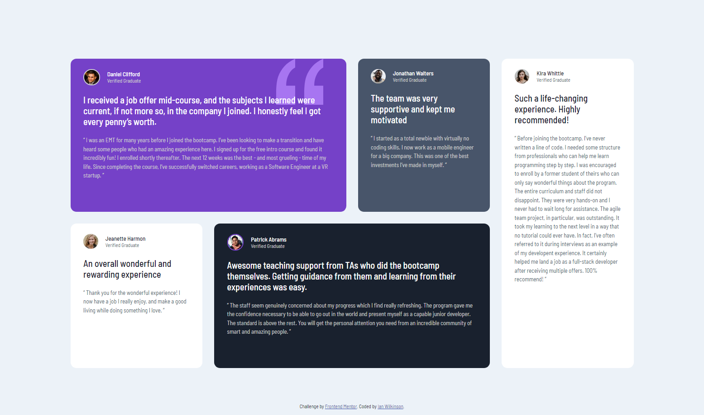
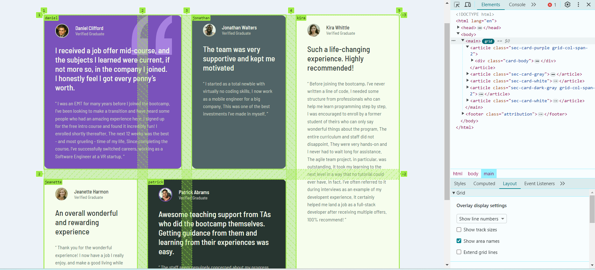

# Frontend Mentor - Testimonials grid section solution

This is a solution to the [Testimonials grid section challenge on Frontend Mentor](https://www.frontendmentor.io/challenges/testimonials-grid-section-Nnw6J7Un7). Frontend Mentor challenges help you improve your coding skills by building realistic projects.

## Table of contents

-   [Overview](#overview)
    -   [The challenge](#the-challenge)
    -   [Screenshot](#screenshot)
    -   [Links](#links)
-   [My process](#my-process)
    -   [Built with](#built-with)
    -   [What I learned](#what-i-learned)
    -   [Continued development](#continued-development)
    -   [Useful resources](#useful-resources)
-   [Author](#author)

## Overview

### The challenge

Users should be able to:

-   View the optimal layout for the site depending on their device's screen size

### Screenshot

Desktop:



Mobile:


### Links

-   [Live Site URL](https://testimonials-ianwilk20.netlify.app/design/)

## My process

### Built with

-   Semantic HTML5 markup
-   CSS custom properties
-   Flexbox
-   CSS Grid
-   Mobile-first workflow

### What I learned

* The difference between article, section, and div. To start with, what they all have in common is that they are used to group content. An article has roots in newspaper articles, which are long-form peices of text that focus on a specific topic. These topics can range from product review to blog posts or tutorials. An `<article></article>` must be a group of related content and it's content must be stand alone/self-contained, meaning you could transplant that content onto any other site and it's purpose should make sense. For example, a job post is a group of related content and if posted on Indeed.com or Facebook or on a blog site, it will make sense regardless of the purpose of those sites. A section defines sections within a document ie. chapters, headers, footers, or other logical divisions; typically, articles are divided into sections. For example, if we have a review of a Hershey's chocolate bar, it may be of: the topics that will be covered and on which page, a write up of the comparison between it and other chocolate bars on the market, the manufactering process, or the nutritional breakdown. Explained another way, a `<section></section>` is a group of related content that requires the context of the site to make sense. A div element is a generic container. I found this image quite useful:

    

* Grid template areas. I found an alternative way to implement the grid layout needed for this challenge using grid template areas. This will create the same layout as what I currently have in my CSS; however, the advantage to using this approach is that it makes specify who goes where/takes up which rows/columns even easier, especially if we want the layout to change significantly depending on the screen size. Here's the alternative approach:

    ```CSS
        main {
            display: grid;
            grid-template-areas:
                'daniel daniel jonathan kira'
                'jeanette patrick patrick kira';
        }

        main article:nth-child(1) {
            grid-area: daniel;
        }

        main article:nth-child(2) {
            grid-area: jonathan;
        }

        main article:nth-child(3) {
            grid-area: jeanette;
        }

        main article:nth-child(4) {
            grid-area: patrick;
        }

        main article:nth-child(5) {
            grid-area: kira;
        }
    ```

    - An added bonus of the above approach is how easy it is to debug the grid as you can see the name of the grid-areas you defined. Simply click on the grid button beside the html element with `display: grid` in the Elements section of DevTools and check the "Show area names" box under Layout:

        

### Continued development

Now that I've had more experience with this challenge, I want to apply it to more use cases. I think this was a good challenge to practice grid basics and I look forward to apply what I learned to harder applications.

### Useful resources

-   [Learn CSS Grid the easy way](https://youtu.be/rg7Fvvl3taU) - A well-explained and in-depth look at the grid layout and how to apply it.
-   [Difference between Section vs Article elements in HTML](https://stackoverflow.com/questions/7549561/difference-between-section-vs-article-elements-in-html) - A great thread the differences between section and article. Although I still have trouble completely wrapping my head around how an article can hold many sections and vice versa, this has got my wheels turning.

## Author

-   GitHub - [ianwilk20](https://github.com/ianwilk20)
